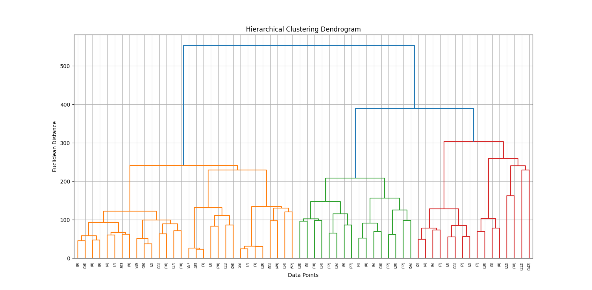
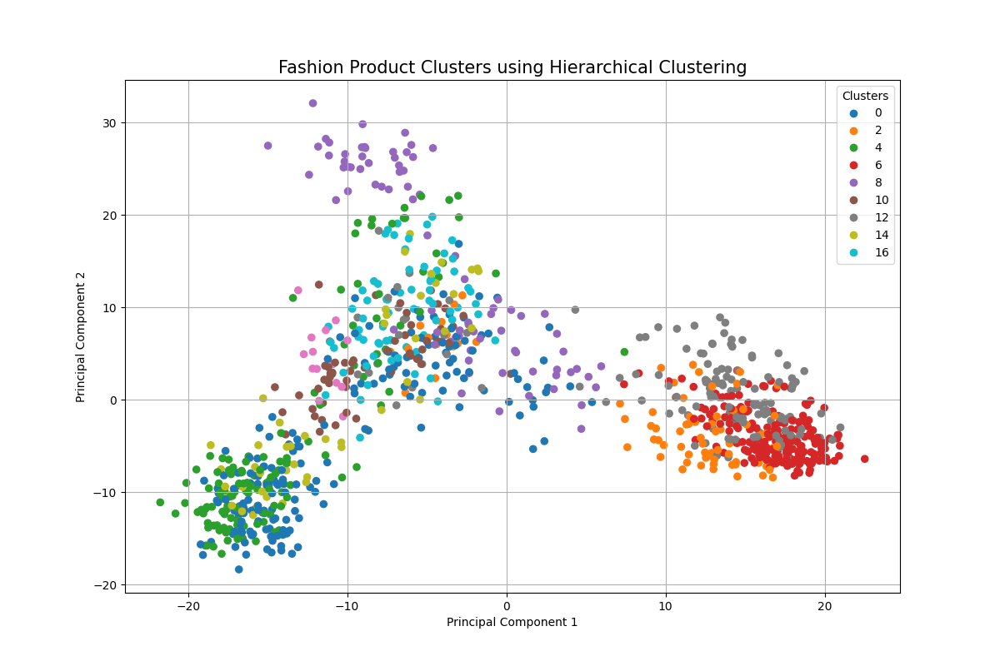
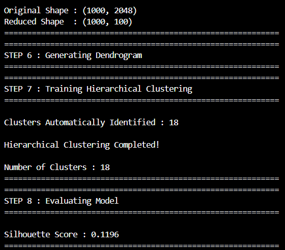
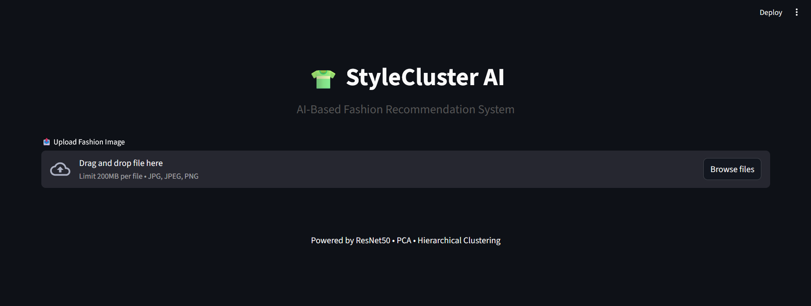
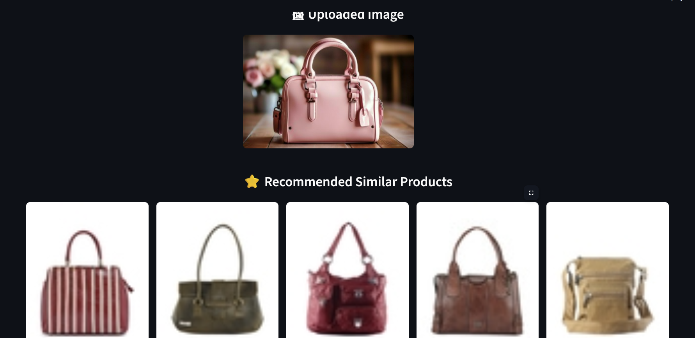

<div align="center">

# 👗 StyleCluster AI 🧠

### AI-Powered Fashion Recommendation Engine

**Deep Learning Feature Extraction &nbsp;•&nbsp; PCA &nbsp;•&nbsp; Clustering &nbsp;•&nbsp; Streamlit**

[](https://www.python.org/)
[](https://www.tensorflow.org/)
[](https://streamlit.io/)
[](LICENSE)

</div>

---

**StyleCluster AI** is an AI-powered fashion recommendation system that uses deep learning feature extraction and unsupervised clustering to find and recommend visually similar fashion products. Upload or select a fashion image, and the app returns items that share similar style, color, and pattern characteristics — no manual tagging required.

---

## 🔍 How It Works

1. **Feature Extraction** — Each fashion image is passed through a pretrained convolutional neural network (via TensorFlow) to extract high-dimensional visual features.
2. **Dimensionality Reduction** — Extracted features are compressed using PCA (`pca.pkl`) to reduce noise and computational cost while preserving the most meaningful visual patterns.
3. **Clustering** — The reduced features are grouped using a clustering algorithm (scikit-learn), producing style clusters (`cluster_centers.npy`, `cluster_labels.npy`) that group visually similar items together.
4. **Recommendation** — Given a query image, the app locates its nearest cluster and surfaces the most visually similar products from that group.
5. **Interface** — A Streamlit app (`app.py`) ties it all together into an interactive, easy-to-use web interface.

---

## 📸 Screenshots

The `pictures/` folder contains screenshots of the app in action — including the Streamlit interface, sample fashion image uploads, and the resulting visually-similar recommendations generated by the clustering model. Browse that folder for a visual walkthrough of the project, or preview a couple of them below:

<div align="center">


&nbsp;&nbsp;





</div>

---

## Features

- 🔍 Deep learning-based visual feature extraction
- 📉 PCA-based dimensionality reduction for efficient similarity search
- 🧩 Unsupervised clustering of fashion products by visual style
- 🖼️ Simple, interactive Streamlit UI for browsing and recommendations
- ⚡ Precomputed features and cluster artifacts for fast inference

---

## Project Structure

```
styleCluster.AI/
├── Dataset/               # Source fashion product images used for training
├── input images/          # Sample images for querying/testing recommendations
├── pictures/              # README/demo screenshots and assets
├── app.py                 # Streamlit application entry point
├── model_training.py      # Feature extraction, PCA, and clustering pipeline
├── features.npy           # Raw extracted feature vectors
├── image_features.npy     # Processed image feature vectors
├── pca_features.npy       # PCA-reduced feature vectors
├── cluster_centers.npy    # Cluster centroid coordinates
├── cluster_labels.npy     # Cluster assignment for each image
├── image_paths.npy        # File paths mapped to feature vectors
├── pca.pkl                # Fitted PCA transformer
├── scaler.pkl             # Fitted feature scaler
├── requirements.txt       # Python dependencies
└── LICENSE                # MIT License
```

---

## Tech Stack

| Category            | Tools |
|---------------------|-------|
| Deep Learning        | TensorFlow |
| Data Processing      | NumPy, Pandas, SciPy |
| Machine Learning     | scikit-learn |
| Image Processing     | OpenCV, Pillow |
| Visualization        | Matplotlib |
| Web App              | Streamlit |
| Utilities            | Joblib, tqdm |

---

## 🚀 Getting Started


### Prerequisites

- Python 3.8+
- pip

### Installation

```bash
# Clone the repository
git clone https://github.com/Khyathi-Priya/styleCluster.AI.git
cd styleCluster.AI

# (Recommended) Create a virtual environment
python -m venv venv
source venv/bin/activate      # On Windows: venv\Scripts\activate

# Install dependencies
pip install -r requirements.txt
```

### Usage

**1. Train / build the model (optional if precomputed artifacts already exist)**

```bash
python model_training.py
```

This extracts features from the images in `Dataset/`, applies PCA, and fits the clustering model — generating the `.npy` and `.pkl` artifacts used by the app.

**2. Launch the recommendation app**

```bash
streamlit run app.py
```

Then open the local URL shown in your terminal (typically `http://localhost:8501`) to start exploring style recommendations.

---

## Dataset

The `Dataset/` directory contains the fashion product images used to train the feature extraction and clustering pipeline. The `input images/` directory can be used to test recommendations with new, unseen images.

> Note: For large-scale use, replace the sample dataset with your own fashion product catalog and re-run `model_training.py` to regenerate the feature and cluster artifacts.

---

## Roadmap

- [ ] Add support for additional pretrained backbones (e.g., ResNet, EfficientNet)
- [ ] Expose a REST API for programmatic recommendations
- [ ] Add evaluation metrics for clustering quality (silhouette score, etc.)
- [ ] Deploy a hosted demo

---

## Contributing

Contributions are welcome! If you'd like to improve StyleCluster AI:

1. Fork the repository
2. Create a feature branch (`git checkout -b feature/your-feature`)
3. Commit your changes (`git commit -m 'Add your feature'`)
4. Push to the branch (`git push origin feature/your-feature`)
5. Open a Pull Request

---

## License

This project is licensed under the [MIT License](LICENSE).

---

## ✨ Author

**Khyathi Priya**
[GitHub](https://github.com/Khyathi-Priya)

If you found this project useful, consider giving it a ⭐!

